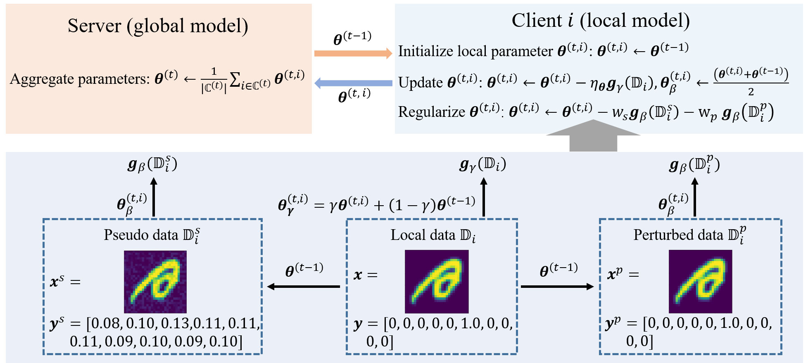

# Acceleration of Federated Learning with Alleviated Forgetting in Local Training

## Abstract

Federated learning (FL) enables distributed optimization of machine learning models while protecting privacy by independently training local models on each client and then aggregating parameters on a central server, thereby producing an effective global model. Although a variety of FL algorithms have been proposed, their training efficiency remains low when the data are not independently and identically distributed (non-i.i.d.) across different clients. We observe that the slow convergence rates of the existing methods are (at least partially) caused by the catastrophic forgetting issue during the local training stage on each individual client, which leads to a large increase in the loss function concerning the previous training data provided at other clients. Here, we propose FedReg, an algorithm to accelerate FL with alleviated knowledge forgetting in the local training stage by regularizing locally trained parameters with the loss on generated pseudo data, which encode the knowledge of previous training data learned by the global model. Our comprehensive experiments demonstrate that FedReg not only significantly improves the convergence rate of FL, especially when the neural network architecture is deep and the clients' data are extremely non-i.i.d., but is also able to protect privacy better in classification problems and more robust against gradient inversion attacks.

## Requirements

Anaconda is recommended to run the project.
~~~
conda create -n FedReg python=3.8
source activate FedReg
~~~

Install torch:
~~~
pip install torch torchvision torchaudio
~~~

Install related packages:
~~~
pip install -r requirements.txt
~~~

Get data from [here](https://drive.google.com/file/d/1w6L9enAEB8e0rsJKDoRfoVDmOm-vfaXg/view?usp=sharing) and unzip it:
~~~
tar -xzvf data.tar.gz
~~~

## Run experiments

The experiments can be run by:
~~~
python main.py -c PATH_TO_CONFIG
~~~
For example:
~~~
python main.py -c tasks/mnist/FedReg_e40_lr1_g4/config
~~~
Please refer to *config_example.py* for the format of the config file. In the "tasks" directory, the config files for all the tasks presented in our paper are provided.
